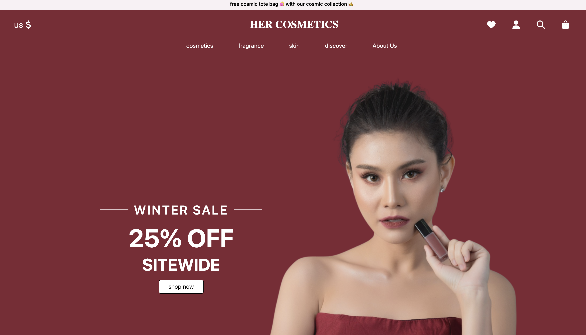
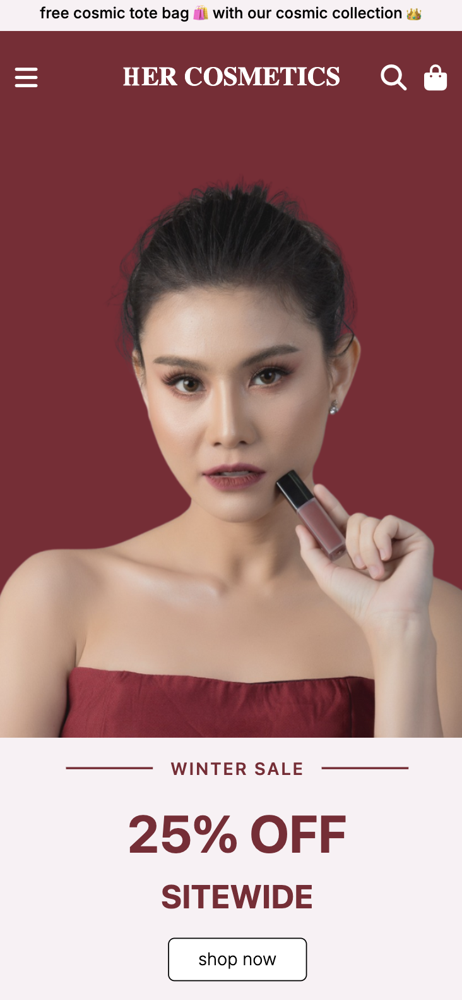
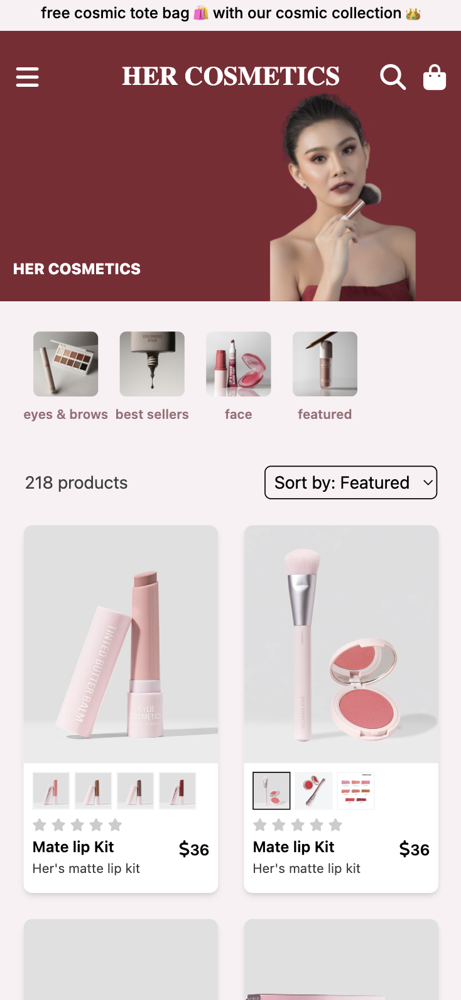
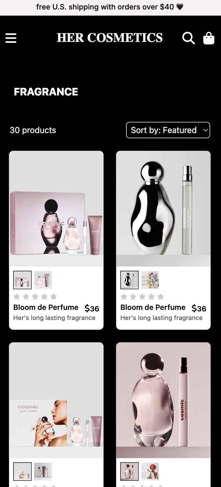
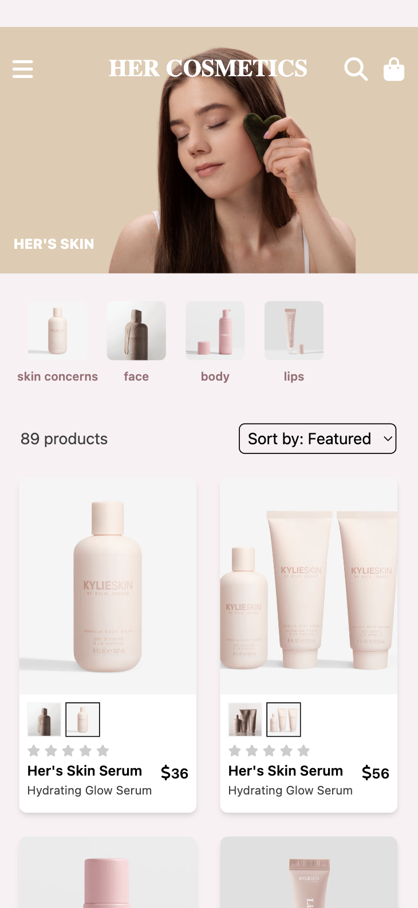
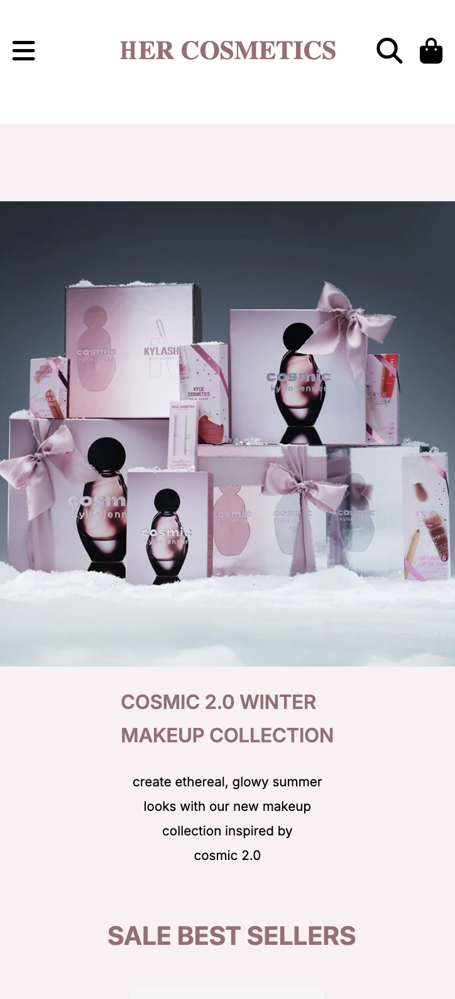
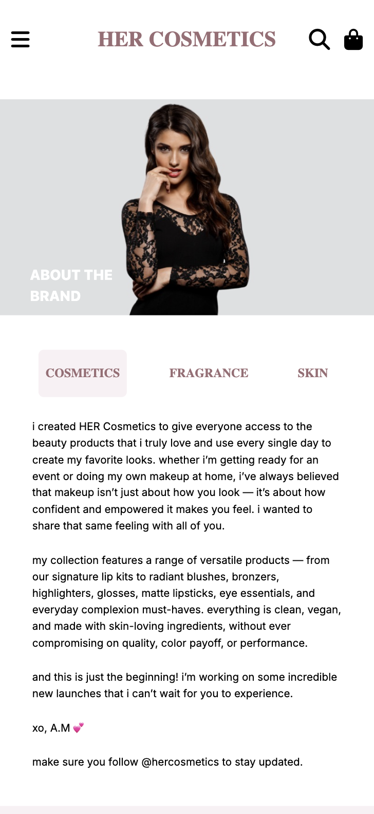
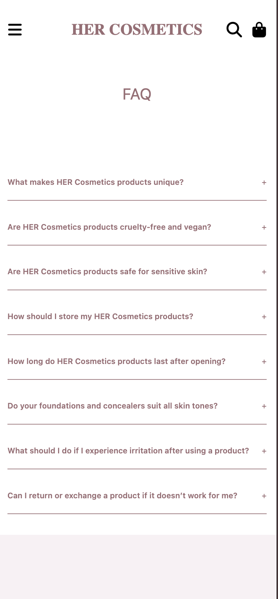
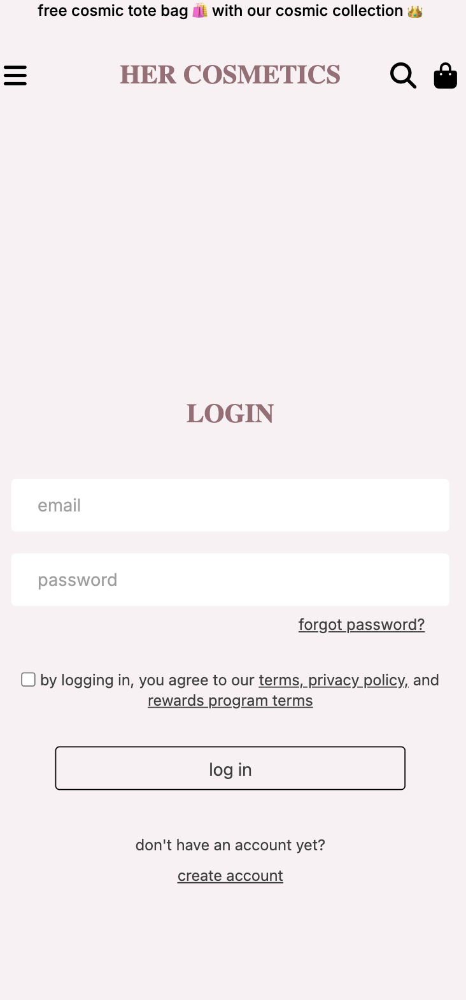

# 💄 HER Cosmetics

An e-commerce store showcasing real-world online shopping features.

## About the project 🚀

**HER Cosmetics** is a frontend e-commerce website originally built using **React and Tailwind CSS**, and later fully migrated into a scalable **Next.js + TypeScript** architecture.

This project started as a UI-heavy React application and was later restructured to feel more like a real-world frontend project, with a focus on scalability, maintainability, and modern Next.js practices.

The goal was not just to build features, but to refactor and evolve a messy component-based project into a clean, structured, and scalable codebase similar to how real frontend teams work in production.

## ⚙️ Architecture Upgrade (React → Next.js)

This project went through a full architectural upgrade:

- ➤ Migrated to Next.js App Router
- ➤ Reorganized the codebase into a feature-based folder structure
- ➤ Introduced separation of **client** and **server** components
- ➤ Broke logic into reusable components, hooks, and context providers
- ➤ Added TypeScript for type safety across the project
- ➤ Added skeleton loading UI to improve perceived performance
- ➤ Added debounced search to reduce unnecessary re-renders
- ➤ Used dynamic imports for code splitting (cart, product pages, heavy UI)
- ➤ Optimized images using Next.js Image (lazy loading + responsiveness)
- ➤ Built a toast system for cart actions
- ➤ Improved filtering and search behavior for smoother UX

### Previous Version (v1)

Click to view previous version (React + Tailwind CSS version)

 

The original version of **HER Cosmetics** was a simple React + Tailwind CSS build focused mainly on UI, with a loosely structured, non-scalable codebase and no TypeScript.

#### 🔗 [View V1 Repository](https://github.com/areebamoosa/HER-Cosmetics)

## ✨ Key Features

- 🛍️ Product discovery with category-based browsing
- 🔎 Live product search with debounced input handling
- 🛒 Cart system with state management
- 💳 Checkout flow UI
- 🔐 Authentication pages (Sign up / Sign in)
- 📄 Brand and informational pages
- 📱 Fully responsive design across all devices
- ⚡ Optimized UI with improved loading states and user feedback (skeletons + toasts)

---

## 🛠️ Technologies Used

- `Next.js`
- `TypeScript`
- `Tailwind CSS`

---

## 🎥 Demo / 🖼️ Screenshots

<table align="center">
  <tr>
    <td align="center" width="220">
      <!--     -->
         
      <b>Homepage</b>
    </td>
    <td align="center" width="220">
       
      <b>Cosmetic's Collection</b>
    </td>
    <td align="center" width="220">
       
      <b>Fragrance Collection</b>
    </td>
    <td align="center" width="220">
       
      <b>Skin Care Collection</b>
    </td>
  </tr>

  <tr>
    <td align="center" width="220">
       
      <b>Featured Product</b>
    </td>
    <td align="center" width="220">
       
      <b>Discover Page</b>
    </td>
    <td align="center" width="220">
       
      <b>About the Brand</b>
    </td>
    <td align="center" width="220">
       
      <b>User Login</b>
    </td>
  </tr>
</table>

### 🌐 Live Demo :

➜ [View Live Website](https://herr-cosmetics.vercel.app)
